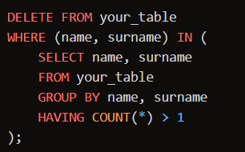
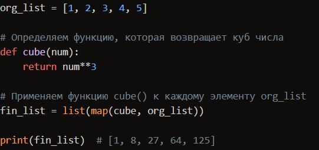
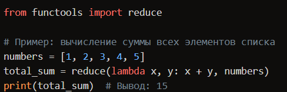

SQL

Разница  между  WHERE  и  HAVING

<strong>WHERE</strong>  используется  для  фильтрации  записей  <strong>до</strong>  группировки,  отсеивая  те,  которые  не  удовлетворяют  заданному  критерию.  В  свою  очередь,  <strong>HAVING</strong>  применяется  <strong>после</strong>  операции  <strong>GROUP</strong>  <strong>BY</strong>  и  позволяет  отфильтровать  группы  записей  по  агрегированным  значениям,  получаемым  с  помощью  функций  <strong>SUM,</strong>  <strong>AVG</strong>  или  <strong>COUNT.</strong>

Разница  между  UNION  и  UNION  ALL

UNION  удаляет  дубликаты

UNION  ALL  соединяет  все

Избавление  от  дубликатов

Python

Разница  между  list  и  tuple

+ <strong>Изменяемость</strong>  <strong>(Mutability):</strong>

+ <strong>Списки</strong>  можно  изменять:  вы  можете  добавлять,  удалять  или  изменять  элементы  в  списке  после  его  создания.

+ <strong>Кортежи</strong>  неизменяемы:  после  создания  кортежа  вы  не  можете  изменять  его  содержимое.

+ <strong>Длина</strong>  <strong>(Length):</strong>

+ Длина  <strong>списка</strong>  может  меняться:  вы  можете  добавлять  или  удалять  элементы.

+ Длина  <strong>кортежа</strong>  фиксирована:  после  создания  кортежа  он  остается  неизменным.

+ <strong>Память</strong>  <strong>(Memory</strong>  <strong>Consumption):</strong>

+ <strong>Списки</strong>  обычно  занимают  больше  памяти,  чем  <strong>кортежи.</strong>

+ <strong>Кортежи</strong>  занимают  меньше  памяти.

+ <strong>Скорость</strong>  <strong>выполнения</strong>  <strong>(Execution</strong>  <strong>Speed):</strong>

+ Из-за  своей  изменяемости  <strong>списки</strong>  могут  быть  немного  медленнее  при  итерации.

+ <strong>Кортежи</strong>  могут  быть  немного  быстрее  при  итерации,  так  как  они  неизменяемы.

+ <strong>Использование</strong>  <strong>в</strong>  <strong>качестве</strong>  <strong>ключей</strong>  <strong>словаря</strong>  <strong>(Dictionary</strong>  <strong>Keys):</strong>

+ <strong>Списки</strong>  не  могут  использоваться  в  качестве  ключей  словаря.

+ <strong>Кортежи</strong>  могут  использоваться  в  качестве  ключей  словаря.

Map

Применяет  определенную  функцию  к  каждому  элементу  в  итерируемом  объекте

Reduce  применяет  функцию  ко  всем  итерируемым  элементам  в  итерируемом  объекте

